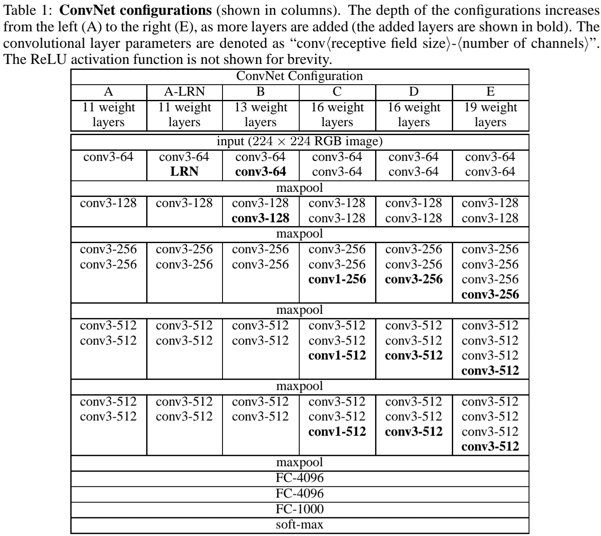
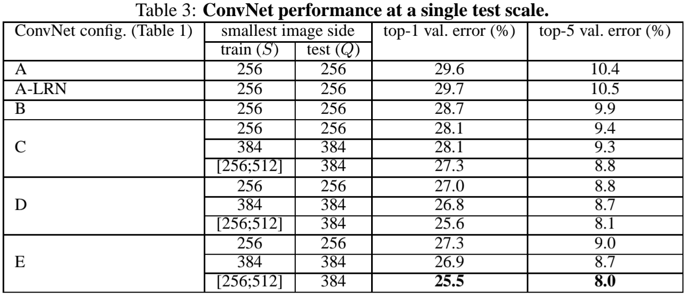
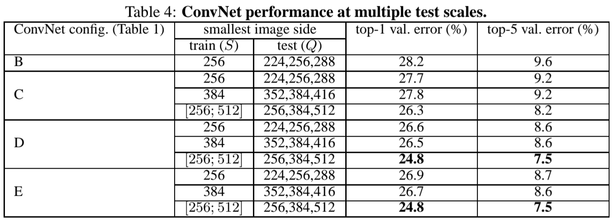
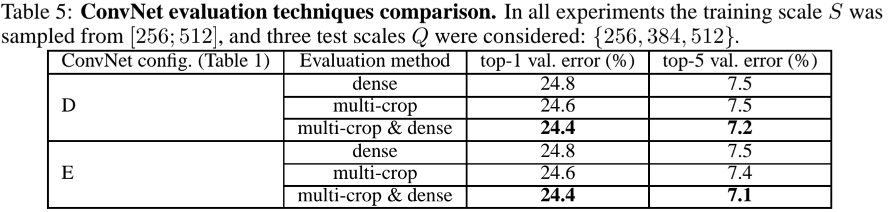

> Simonyan, K., & Zisserman, A. (2014). Very deep convolutional networks for large-scale image recognition. [arXiv preprint arXiv:1409.1556](https://doi.org/10.48550/arXiv.1409.1556).

## Introduction

- 논문은 ConvNets이 컴퓨터 비전 영역의 중요한 요소가 되었음을 설명한다.
- 논문은 이 연구에서 ConvNet 구조 설계에서 **깊이**의 중요성을 다룰 것 이라고 한다.
- 그리고 연구의 결과로 제안된 ConvNet 구조가 ILSVRC classification과 localisation에서 SOTA를 달성했을 뿐 아니라 다른 이미지 인식 데이터세트에도 적용할 수 있음을 보인다.

## Architecture

- ConvNet 깊이에 따른 성능 향상을 측정하기 위해 연구에서 제안한 모든 모델은 동일한 원칙하에 설계되었다.
	- input size: $224 \times 224$
	- preprocessing: subtracting the mean RGB value, computed on the training set
	- window size: $3 \times 3$
	- stride: $1$ pixel
	- padding: $1$ pixel for $3 \times 3$ conv
	- pooling: Max-pooling ($2 \times 2$ pixel window, stride $2$)
- 단, 일부 ConvNet은 비교를 위해 다른 구조를 갖는다.
- 각 ConvNet은 서로 다른 깊이를 갖지만 동일한 구조의 Fully-Connected layers를 따른다.
	- 1th, 2nd: $4096$ channels
	- 3rd: $1000$ channels (ILSVRC classification)
	- soft-max
- 모든 히든 레이어는 ReLU 활성화 함수를 갖는다.
- Table 1은 제안된 ConvNet의 구성 요소표이다.
	- 깊이는 좌측(A)에서 우측(E)로 갈수록 깊어진다.
	- 연속된 구성요소(컬럼)에서 **bold**체를 통해 추가된 레이어를 표시하였으며 ReLU 활성화 함수는 명시적으로 표기되지 않았다.

- 표를 통해서 이후 제시된 실험을 유추해볼 수 있다.
	- (A)와 (A-LRN)은 LRN(Local Response Normalisation)의 유뮤에 따른 성능 차이를 보일 것으로 예상된다.
	- (C)와 (D)는 같은 깊이에서 커널 크기에 따른 성능 비교를 수행할 것으로 예상된다.
	- (A), (B), (D), (E)를 통해서 깊이에 따른 성능 비교를 수행할 것으로 생각된다.
	
- 또한, 모델이 깊어질수록 더 많은 특징맵을 추출한도록 설계되었음을 알 수 있다.

## Key-Experiments

- 아래 Table 3는 단일 스케일 테스트에서 제안된 모델의 성능을 보인다.
- 위에서 유추한 것 처럼 모델 별 성능 비교를 수행한다.
	- LRN을 사용하지 않은 것이 모델 성능에 더 도움이 되었다.
	- Conv 필터를 통해 공간적인 특성을 파악하는 것 또한 중요하다.
	- 깊어질수록 더 높은 성능을 보였다.

- 저자들은 그 외로 다양한 규모(multi-scale) 이미지에 대한 성능을 분석하기 위해서 학습 데이터에 scale jittering Augment를 수행했다.
	- scale jittering: sample $S$에 대해 $[S_{min}, S_{max}] 범위 안에서 무작위로 rescale 한 후, input size로 crop한다.
	- 논문에서는 속도적인 이유로 $S=384$로 pretrain 한 후, fine-tuning 하는 형태로 학습하였다.
- scale jittering을 적용한 모델이 단일 스케일 테스트에서 성능향상을 보였다.
- 저자들은 (표에는 나타나있지 않지만) Conv $3 \times 3$ 2개 층을 단일 Conv $5 \times 5$ 층으로 변환하여 성능 비교를 수행하였는데, 제안된 모델이 더 높은 성능을 보였다고 한다.

- 아래 Table 4는 멀티 스케일 테스트에서 제안된 모델의 성능을 보인다.
- 학습 데이터의 크기가 고정되었을 때 테스트 데이터의 크기 범위가 다양하다면 성능이 오히려 하락했기 때문에 그 범위를 축소했다고 한다.

- 실험을 통해 scale jittering을 수행한 모델이 mulit-scale 테스트에서도 성능이 향상을 확인할 수 있다.

- 아래 Table 5는 Multi-Crop과 Dense Evaluation기법을 적용하였을 때의 결과이다.
- 표를 통해 두 기법을 모두 적용한 것이 독립적으로 적용하였을 때 보다 성능이 향상됨을 확인할 수 있다.

## Conclusion and Personal Reflection
- VGG 모델은 간단하며 이해하기 쉽지만 깊은 구조를 가지고 있어 학습하기 어렵다.
- 다양한 실험을 통해 깊은 ConvNet에 대한 인사이트를 얻을 수 있었다.

- 모델이 깊어질수록 Conv. Layer가 더 많은 특징맵을 추출하도록 구조를 작성하였는데 이러한 구조가 어떤 의미를 갖을까 궁금하다.
- Conv $1 \times 1$를 Max-Pooling 직전에 두었는데 $3 \times 3$ 사이에 둘 경우 어떤 차이를 보일까 궁금하다.
- 마지막 실험에서 Multi-Crop과 Dense Evaluation 기법을 사용하였다. 나는 두 기법이 무엇을 의미하고 이 실험이 어떤 인사이트를 주는지 이해하지 못했다. 추가적인 공부가 필요하다.
